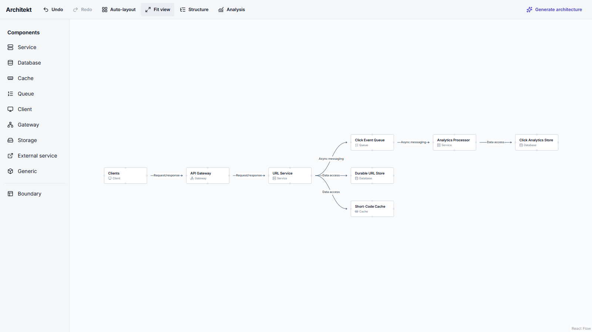
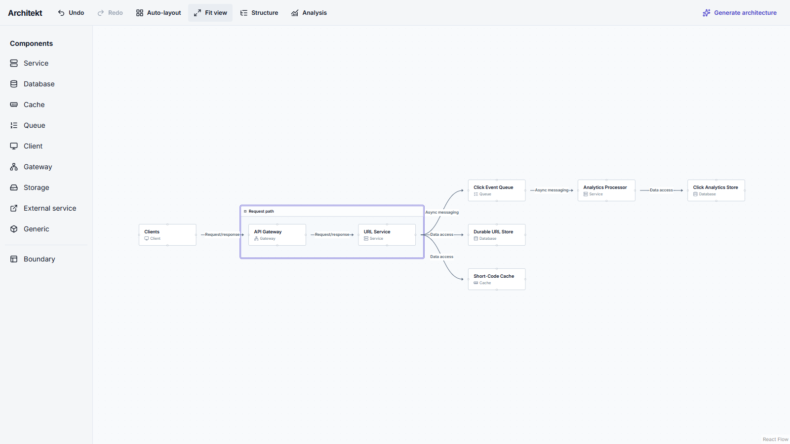
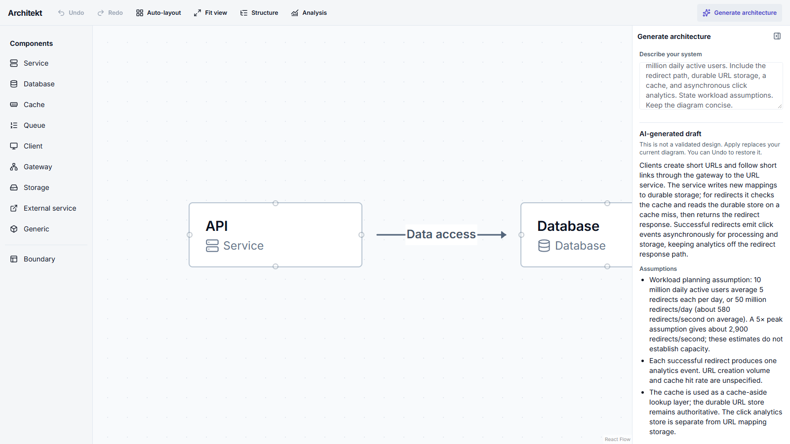

# Architekt

**A visual workbench for thinking through software systems.** Describe a system to get an editable architecture draft, or build the diagram yourself. Architekt keeps components, directed relationships, boundaries, and layout as structured workspace data so you can inspect, revise, undo, and revisit a design.

System design often ends up split between an easy-to-change whiteboard and notes that explain the decisions. Architekt keeps a plain-text Design Brief beside the diagram so requirements, assumptions, and tradeoffs stay with the editable workspace.



## What you can do

- Create nine kinds of components and classify directed connections as request/response, asynchronous messaging, streaming, data access, or generic.
- Connect nodes from four adaptive sides, including keyboard operation; reciprocal relationships keep distinct directions and labels.
- Create named, one-level boundaries, explicitly manage membership, move grouped components, and run boundary-aware Auto-layout.
- Use deterministic Analysis for topology observations and cautious relationship-review questions. It does not score a design.
- Open the Design Brief from the document title to record requirements, open questions, and the reasons and downsides behind choices. Save the whole brief as one Undo step.
- Download the complete architecture and Design Brief as an editable JSON file, or preview and explicitly replace the current document from an Architekt file. Undo restores the previous document.
- Generate a typed AI proposal, review its summary and assumptions, then explicitly **Apply** or **Discard** it. Apply replaces the diagram in one Undo step.
- Undo and redo meaningful edits; save the current graph, boundary membership, and positions locally across refreshes. **Fit view** changes only the viewport.

The canvas is a view of the architecture. An immutable `ArchitectureGraph` owns components, connections, boundaries, and invariants; React Flow nodes and edges are derived from it. `ArchitectureEditorState` owns positions, document-level DesignContext, and transient renderer measurements, while bounded history stores only graph, positions, and context. The V5 local document restores through public domain operations and strictly validates saved data, including V1–V4 migrations. Analysis is deterministic, graph-only, and read-only. AI output passes runtime and domain validation before it can become a draft or an applied graph.

**Stack:** Next.js 16, React 19, TypeScript, React Flow, Dagre, Tailwind CSS 4, Vitest, and Playwright.

## Screenshots

| Boundary editing | AI proposal review |
| --- | --- |
|  |  |

These show the real application using a URL-shortener proposal. The proposal is an example for review, not a claim that the architecture is complete or correct.

## Three-minute demo

1. Enter a system requirement, such as a URL shortener with redirect traffic and click analytics, and select **Generate architecture**.
2. Review the draft's assumptions, component kinds, and connection directions. Explain that the workspace is unchanged until **Apply to diagram**.
3. Apply, open **Analysis**, and distinguish a graph observation from a performance or reliability claim.
4. Change a relationship kind in **Structure**. Create a boundary around a related part of the system.
5. Select **Auto-layout**, then **Undo** and **Redo** to show one-step canonical history. Use **Fit view** to reframe without moving components.
6. Refresh to show that the graph, boundaries, and positions return; the AI prompt and review do not.

**Fallback if generation is slow or unavailable:** before the demo, prepare the same URL-shortener workspace in the demo browser and let local autosave finish. Begin at steps 3–6. A useful prepared graph has a client, gateway, shortener service, URL database, cache, click-event queue, analytics service, and analytics database. It can be edited and analyzed without an API key. Architekt currently saves one local workspace per browser origin, so use that same browser for the fallback.

## Run locally

Use Node.js 22 or later:

```bash
npm ci
npm run dev
```

Open `http://localhost:3000`. The editor works without an OpenAI key. To enable generation for controlled local use, copy the variable names from `.env.example` into ignored `.env.local`:

```text
OPENAI_API_KEY=your-server-side-key
ARCHITEKT_OPENAI_MODEL=gpt-6-luna
```

`OPENAI_API_KEY` is server-only. `ARCHITEKT_OPENAI_MODEL` is optional; the default is `gpt-6-luna` with medium reasoning, retained after a [seven-prompt Luna/Sol evaluation](docs/evaluations/ai-generation-2026-10-01.md). Generation has request and output bounds, a 40-second deadline, zero automatic retries, no application prompt logging, and safe public error messages. Prompts and proposal metadata are transient. Cancellation protects the editor from stale results, though an already-started provider request may still incur usage.

Run validation with:

```bash
npm test
npx tsc --noEmit
npm run lint -- --quiet
npm run build
npx playwright install chromium
npm run test:e2e
```

The browser smoke suite covers the loaded editor, a canonical edit with Undo/Redo, Structure, Fit view, and an immediate refresh before the normal autosave debounce. CI runs the same checks on pushes and pull requests.
On Windows, if Playwright's automatic server shutdown stalls, run `npm run start -- -p 3100` in a separate terminal before `npm run test:e2e`; the local suite reuses that server.

## Intentional limits

Architekt has one browser-local workspace. It has no accounts, cloud sync, public sharing, or PNG/Markdown document export yet. Portable JSON import replaces the complete current document after validation and preview; it does not merge documents. Design Brief content is user-authored context, not verified architecture fact; deterministic Analysis does not use it, and AI does not write it in v1. The graph itself does not capture workload, protocols, deployment, or runtime measurements. Analysis reports only facts and review questions supported by the modeled graph; it cannot prove security, capacity, availability, or correctness. AI drafts need human review. A public deployment with server-funded generation needs abuse and rate controls before anonymous access. Keyboard, DOM semantics, and visible focus have been checked; actual screen-reader speech has not been verified.

This is a personal portfolio project, built as a product rather than a starter template. The [architecture notes](ARCHITECTURE.md), [product intent](PRODUCT.md), and [work log](TODO.md) describe the decisions and current scope.
