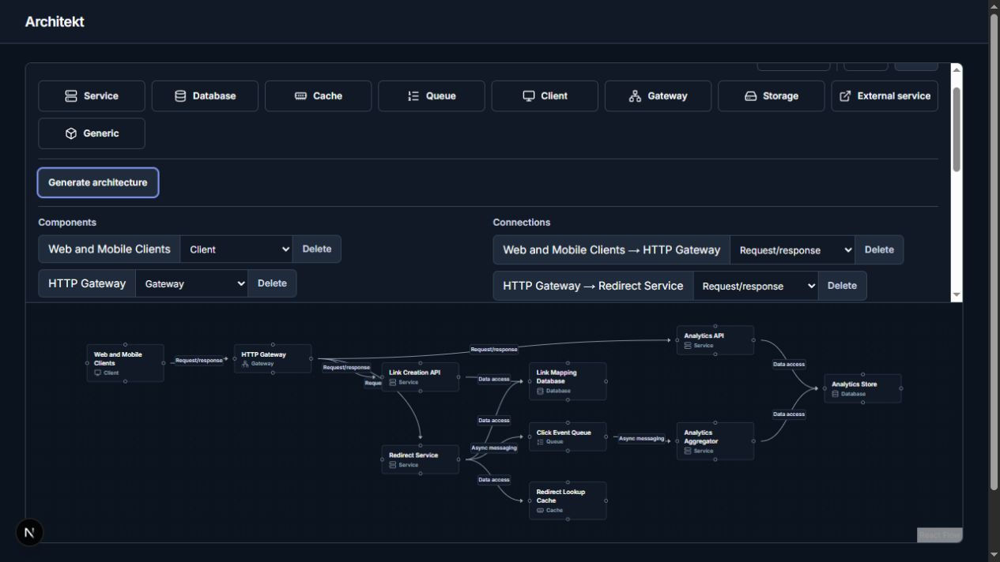

# AI Architecture Generation: Step 4 acceptance

Date: 2026-10-01. Decision: accept the milestone for the existing controlled-access application and retain **gpt-6-luna, medium reasoning**. No model picker, new domain feature, or dependency was added. Public anonymous deployment still requires the previously documented authentication and abuse controls.

## Method and evidence

The fixed set covered a URL shortener at approximately 10M DAU, real-time chat, asynchronous image/video processing, checkout/orders, file storage/sharing, a minimal three-component CRUD app, and an ambiguous save/share backend. Exact prompts, final server instructions, all 14 final proposals, token usage, elapsed times, and deterministic layout checks are preserved in [the evaluation record](ai-generation-2026-10-01.json). These are synthetic evaluation inputs, not user documents or production telemetry.

Luna was evaluated first through the real UI and real `/api/architecture/generate` endpoint. Concrete baseline weaknesses triggered comparison with Sol medium. Both models then received the same seven user prompts, schema, revised server instructions, 40-second deadline, zero retries, and 12,000-token output limit. The final comparison used the actual provider adapter and generation service with real OpenAI requests; no generated response was mocked. Temporary local evaluation instrumentation captured usage without changing production logging. Supplemental UI requests are separate stochastic samples, not the identical recorded comparison responses.

All 14 final requests passed the existing runtime parser and public domain admission. That proves structural validity, not architectural correctness. Each was translated and passed through the real layout module: every node had finite coordinates and no 176 x 72 fallback rectangles overlapped. Browser checks assessed actual labels and usability separately; the numeric layout check does not establish label readability.

## Quality rubric and findings

Each result was assessed for relevant components, missing/excess components, connection direction, semantic kinds, explicit assumptions, unsupported certainty, layout readability, and usefulness as a starting point. There is no single reference architecture. A queue, separate service, or cache is not required merely because another valid design contains one.

| Prompt | Luna medium, after fix | Sol medium, after fix |
| --- | --- | --- |
| URL shortener | 10 components/11 edges. Relevant creation, redirect, cache and async analytics paths; directions and kinds match intent. Consistent 100M redirects/1M creations per day and 100:1 ratio; peak multiplier, retention and availability stated as assumptions. Separate analytics query/processing services add size but serve concrete roles. Deletion/cache invalidation and event-publication durability remain unspecified. Useful draft. | 9/9. Combines creation/redirect in one service; valid simplification. Correct kinds/directions and approximately 5,800 peak redirects/s from 50M/day at 10x peak. Explicit best-effort analytics, expiry and retention. More concise; still leaves failure/deployment details open. Useful draft. |
| Chat | 6/9. Persistence, history recovery, presence and explicit gateway-to-client Streaming are present. Direct service-to-gateway push is a valid alternative to a queue; live delivery is explicitly best-effort. Missing workload dimensions and deduplication are acknowledged. Gateway routing and push failure recovery need further design. Useful draft. | 7/9. Adds a concrete event distribution queue, correctly directed push and history-based repair. Kinds are appropriate. Clearly qualifies offline delivery, presence and small-group assumptions. Database-to-event publication consistency is unspecified. Useful draft with somewhat clearer recovery copy. |
| Media pipeline | 8/10. Storage, status DB, workers, retry and dead-letter paths are relevant; data-access and async directions are correct. Workload and at-least-once assumptions are explicit. The combined upload/status API is labeled Gateway even though it owns application work; Service would communicate its responsibility better. Upload verification and DB/enqueue atomicity are not explained. Useful, with these review points. | 6/9. Compact service/queue/worker design with retries and terminal failure in the DB; a separate dead-letter component is not necessary for that choice. Correct kinds/directions. Explicit verified uploads, idempotency and workload assumptions. DB/enqueue atomicity remains open. Useful and clearer about upload completion. |
| Checkout/orders | 11/11. Cart, reservation, payment, orders/outbox and fulfillment all have relevant paths. Correct directions and kinds. Explains duplicates, compensation and non-atomic distributed steps without exactly-once claims. Payment capture timing and reconciliation execution are left unspecified. Useful draft. | 9/8. Polls a durable fulfillment-ready record rather than adding a queue: a valid asynchronous design. Correct kinds/directions. Stronger explanation of stable keys, crash uncertainty and provider limitations. Still requires detailed inventory/payment state transitions. Useful, somewhat simpler draft. |
| File sharing | 4/4. Separates bytes/metadata, direct transfers use Data access, assumptions cover large files and scoped grants. API-to-storage Request/response is explained as obtaining grants rather than transferring bytes; this is a defensible control-plane distinction, but needs review because storage grants are commonly signed locally. Link revocation does not explain already-issued URL lifetime. Useful with that limitation. | 4/4. Correct Data access edges, multipart/finalization flow and explicit private storage. Clearly states that issued URLs survive revocation until expiry, token hashing and cleanup. Workload figures are labeled planning assumptions. Useful, with stronger access-control caveats. |
| Minimal CRUD | 3/2. Exactly the requested client/service/database; correct request/data-access direction and kinds, no unnecessary infrastructure. Authentication/deployment are explicitly outside this minimal diagram. Clear, useful draft. | 3/2. Same minimal structure and correct semantics. Concisely places authentication in the service. Clear, useful draft. |
| Ambiguous backend | 4/3. Chooses small records and controlled sharing; no speculative cache/queue/workers after the prompt fix. Gateway is optional extra structure, not a defect. Correct directions/kinds; interpretation is explicit, but workload/latency targets remain unstated. No claimed guarantees. Useful starting assumption to confirm with the user. | 3/2. Smallest service/database approach, explicit registered-user sharing and small-record interpretation. Correct semantics; no unnecessary infrastructure. Workload objectives are still absent. Useful and more concise. |

Readability: simple CRUD, file-sharing and ambiguous diagrams are clear after Apply. Larger branching diagrams require zoom/pan to read at fit-to-view; chat cycles and reciprocal relationships can crowd labels. Nodes remain editable and Auto-layout remains available. Collision-free edge labels and obstacle routing were already deferred and are not claimed here. The same layout engine is used for both models; Sol's typically smaller outputs can help density, but do not guarantee better routing. The final Sol comparison was inspected as proposals plus deterministic layout, not as seven separate browser screenshots.

Baseline defects were concrete: Luna made a tenfold request-rate arithmetic error in the first URL-shortener sample, repeatedly classified direct file transfer as Streaming, and sometimes overbuilt the ambiguous request. Sol also misclassified storage transfer as Request/response and omitted the independently directed server push edge in its initial chat sample. The server instructions now define the existing semantic vocabulary, distinguish reply versus independent reverse flow, ask for internally consistent arithmetic, and discourage infrastructure unsupported by a workflow. Final samples improved on those issues; this small evaluation does not establish an error rate or guarantee future outputs.

## Model, latency and cost decision

| Prompt | Luna medium | Sol medium |
| --- | ---: | ---: |
| URL shortener | 16.687 s | 14.086 s |
| Chat | 20.584 s | 15.111 s |
| Media pipeline | 15.172 s | 14.638 s |
| Checkout | 17.553 s | 20.174 s |
| File sharing | 12.924 s | 12.471 s |
| CRUD | 2.561 s | 2.995 s |
| Ambiguous | 6.813 s | 7.532 s |
| Median | 15.172 s | 14.086 s |

Elapsed time covers the awaited provider/service call, excluding human inspection and browser-tool round trips. One recorded run per model/prompt is not a latency benchmark. No final request hit the 40-second deadline. Sol high was unnecessary: medium already supplied a useful stronger comparison.

The seven Luna calls used 4,170 input and 10,180 output tokens; Sol used 4,170 input and 6,478 output tokens, including reasoning. At published standard short-context prices on the evaluation date, their estimated totals are **$0.005507** and **$0.073120**, respectively (about 13.3x for this set). These are estimates for the recorded final comparison only, not the session's total bill. See official [Luna pricing](https://developers.openai.com/api/docs/models/gpt-6-luna) ($0.10/$0.50 per million input/output tokens) and [Sol pricing](https://developers.openai.com/api/docs/models/gpt-6-sol) ($2/$10). Actual account/tier charges may differ.

Retain Luna medium: its drafts meet this milestone's human-reviewed starting-point purpose after the instruction fix. Sol offers useful concision and stronger operational caveats in several cases, but no consistent enough advantage here to justify changing the default. Neither model validates capacity, reliability, security, or distributed correctness. `ARCHITEKT_OPENAI_MODEL` remains a server-only override; no UI model choice was introduced.

## Browser acceptance and fixes

Preflight confirmed server-side key presence without exposing its value, no model override, normal app loading, and successful real generation. Existing user configuration was not edited.

Passed in the real UI:

- Prompt entry, loading, Cancel, draft labeling, summary/assumptions, readable directed review lists, explicit replacement/Undo warning, and Discard preservation.
- Apply is disabled during rename; successful Apply fits an arranged, typed, editable graph. Drafts do not change the existing workspace before Apply.
- Exactly one Apply history entry: one Undo restored prior node names/kinds, positions and connections; one Redo restored the generated equivalents. Reload retained graph/positions and cleared prompt/review. Codec/Apply tests additionally verify that proposal metadata never enters the persisted document or history.
- Keyboard activation of Generate, Cancel, Apply and Discard; actual Tab from prompt to Generate and Enter to Cancel; focus restoration to Generate architecture. Cancel followed immediately by a distinct request retained the newer review after the old completion window.
- Blank input in the UI; blank and 5,001-character requests returned HTTP 400. Missing-key production server and a separate server configured with an invalid provider model showed safe configuration errors, preserved the example workspace and kept Undo unavailable. These servers used process-local overrides, not environment-file edits. Live 429/timeout outages were not deliberately induced; network-free tests cover their typed handling.
- Manual rename, kind editing, node movement, one-step drag undo, selection/Delete and cascading connection removal, undo restoration, shared keyboard anchors, reciprocal edge labels/arrows, and Auto-layout.
- Dark appearance and temporarily forced light palette, restored to normal media detection afterward. Narrow 390 x 844 viewport retained a 381px canvas and no page horizontal overflow. Actual screen-reader speech and OS theme switching were not available; live-region/alert semantics and keyboard focus were inspected. This is a spot-check, not accessibility certification.

Small fixes made during acceptance:

1. Bound the existing controls area to half the editor height with scrolling. Larger generated lists previously reduced the canvas to zero height.
2. Explain replacement and Undo before Apply, and expose a polite draft-ready status.
3. Use white primary-action text in both themes; the former surface-color text became dark on an indigo button in dark mode.
4. Preserve the Generate button DOM element when it becomes Cancel. Prevent Cancel's default click action before it becomes a submit button again, avoiding unintended resubmission.
5. Clarify existing generation semantics in the server prompt as described above. No domain invariants, persistence schema, layout algorithm, or history contracts changed.

Cancellation protects the client workspace; an already-started server/provider request may still finish and incur usage. Generation quality varies. Long labels/cyclic graphs can need manual arrangement. Invalid configuration is intentionally presented through one safe application-owned message rather than raw provider detail.

## Verification and scope

Final verification passed: 88 focused tests across seven files; 772 full-suite tests across 44 files; `npm run lint -- --quiet`; `npm run build`; `git diff --check`; and `npm audit --omit=dev` (zero vulnerabilities). The scoped UI detector also exited successfully without findings. Browser-only focus and layout checks supplement the existing browser-free Vitest conventions; no dependency or new test framework was installed. Impeccable tooling/sidecar maintenance was not performed. No subsequent milestone was started.

